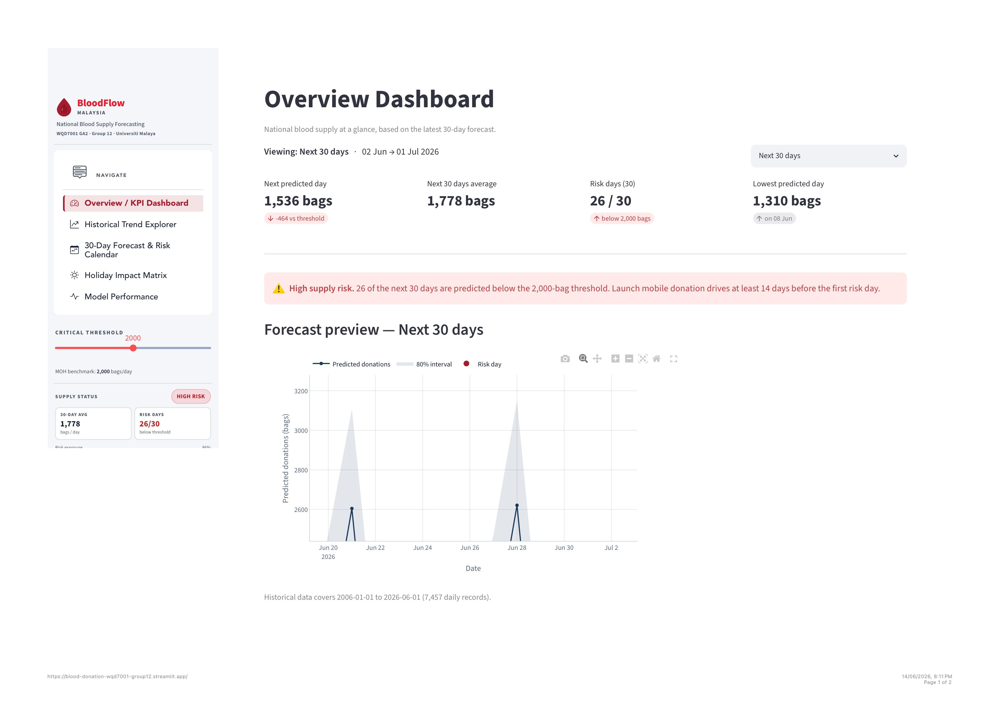

# 🩸 Blood Supply Forecasting Dashboard — Malaysia National Blood Centre

A time-series forecasting project predicting daily blood supply levels across Malaysia 
using Facebook Prophet, built as part of the Master of Data Science programme at 
Universiti Malaya (WQD7001).

🔗 **Live Dashboard:** https://blood-donation-wqd7001-group12.streamlit.app/

---

## 📌 Problem Statement

Malaysia's National Blood Centre (Pusat Darah Negara) operates largely on a reactive 
basis — broadcasting urgent social media appeals only after shortages occur. This project 
replaces that reactive model with a proactive, data-driven forecasting system built on 
7,457 daily donation records (2006–2026) to predict future supply trends and support 
early-warning campaign planning.

---

## 🎯 Objectives

1. Analyse the impact of Malaysian public holidays and seasonal festivals on daily blood 
donation volumes through historical trend analysis
2. Model future blood donation counts for the next 30 days using Meta Prophet, trained 
on 2006–2024 data with engineered Malaysian holiday features
3. Evaluate the forecasting model using MAE, RMSE and MAPE and translate forecasts 
into actionable donor recruitment recommendations for PDN

---

## 🛠 Tools & Technologies

| Category | Tools |
|---|---|
| Language | Python 3.10 |
| Forecasting | Facebook Prophet |
| Data Wrangling | pandas, NumPy |
| Visualisation | Matplotlib, Seaborn, Plotly |
| Dashboard | Streamlit |
| Environment | Google Colab |

---

## 📊 Dataset

- **Source:** [Malaysia Open Data — data.gov.my](https://data.gov.my/data-catalogue/blood_donations)
- **Records:** 7,457 daily entries (1 Jan 2006 – 1 Jun 2026)
- **Features:** Date, donation count (national aggregate), blood type
- **Additional:** Malaysian Public Holidays via MalaysiaHoliday Python library (210 entries)

---

## 🔍 Key Findings

### Holiday Impact Matrix
| Holiday | Avg Before | Avg During | Impact |
|---|---|---|---|
| Hari Raya Aidilfitri | 849 bags | 202 bags | **-73.9%** |
| Hari Raya Aidiladha | 1,212 bags | 321 bags | **-73.2%** |
| Chinese New Year | 1,236 bags | 753 bags | **-43.1%** |
| Christmas | 1,166 bags | 1,029 bags | **-17.6%** |

### Day-of-Week Pattern
- **Sunday** is peak day (2,088 bags) — driven by weekend mobile drives
- **Monday** is lowest (863 bags) — nearly 2.5x lower than Sunday

### Model Performance (2025 Holdout — 517 days)
| Metric | Prophet Model | Naive Baseline | Improvement |
|---|---|---|---|
| MAE | 323.68 bags/day | 517.40 | **37.4% better** |
| RMSE | 405.99 bags/day | 681.21 | **40.4% better** |
| MAPE (adjusted) | 25.29% | — | — |

### 30-Day Forward Forecast (Jun–Jul 2026)
- Average predicted: **1,778 bags/day**
- Lowest predicted day: **1,310 bags** (8 Jun 2026)
- **26 out of 30 days** flagged below the 2,000-bag MOH threshold

---

## 📁 Repository Structure

```
bloodflow-malaysia-forecasting/
│
├── notebooks/
│   └── BloodDonation_GA2_FINAL.ipynb
│
├── images/
│   └── dashboard_overview.jpg
│
├── outputs/          ← auto-generated CSVs for dashboard
│
└── README.md
```

---

## 🚀 How to Reproduce

1. Open `BloodDonation_GA2_FINAL.ipynb` in Google Colab
2. Click **Runtime → Run all**
3. The notebook fetches D1 live from data.gov.my — no manual data prep needed
4. Runtime: approximately 3–5 minutes
5. Download the `outputs/` folder and replace CSVs in this repo to update the dashboard

```bash
git clone https://github.com/Farah-Annisa/bloodflow-malaysia-forecasting.git
cd bloodflow-malaysia-forecasting
pip install -r requirements.txt
```

---

## 📸 Dashboard Preview



🔗 Live at: https://blood-donation-wqd7001-group12.streamlit.app/

---

## 👥 Team — Group 12

| Name | Matric No | Role |
|---|---|---|
| Farah An'nisa Binti Norhisham | 25092902 | Leader — Forecasting Model, Dashboard |
| Nurimmran Bin Johari | 24221213 | Secretary |
| Sarah Sahira Binti Zamri | 25089582 | Detective |
| Azreen Shahirah Binti Muhammad | 17202754 | Oracle |
| Nur Athirah Batrisyia Binti Hamizul | 25076033 | Maker |

---

## 📚 References

- Taylor, S.J. & Letham, B. (2018). Forecasting at scale. *The American Statistician.*
- Government of Malaysia (2026). Daily Blood Donations — [data.gov.my](https://data.gov.my/data-catalogue/blood_donations)
- Pusat Darah Negara Malaysia — [pdn.gov.my](https://www.pdn.gov.my)
- Malay Mail (2024). Health minister: 2,000 blood bags needed daily nationwide.

---

## 🎓 Academic Context

**Course:** WQD7001 — Principles of Data Science (GA2)
**Institution:** Universiti Malaya (UM), Faculty of Computer Science & IT
**Programme:** Master of Data Science
**Semester:** 2, Session 2025/2026
**Lecturer:** Assoc. Prof. Dr. Maizatul Akmar Binti Ismail

